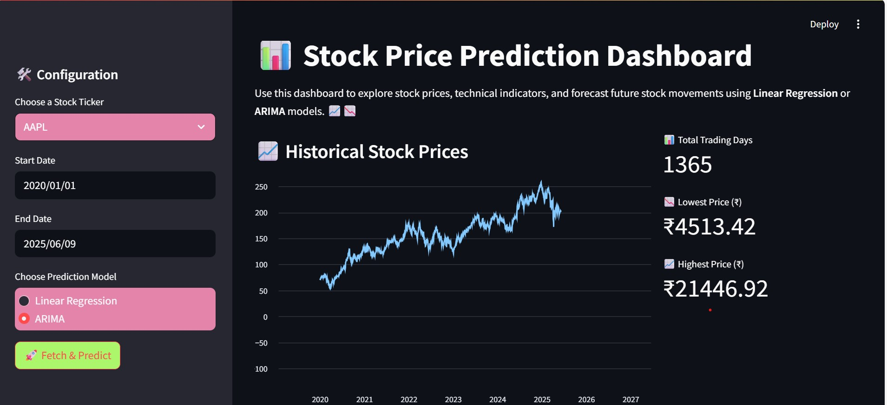

Overview

stockprediction_arima-linear_regresion is a robust developer tool that empowers users to forecast stock prices through an interactive dashboard, leveraging advanced statistical models like Linear Regression and ARIMA.

This project enhances investment decision-making by providing a comprehensive analysis of historical stock prices and predictive insights. The core features include:

 Interactive Dashboard: Visualize stock data and forecast trends effortlessly.

 Model Selection: Choose between Linear Regression and ARIMA for tailored predictions.

 Technical Indicators: Calculate moving averages, RSI, and MACD for deeper market insights.
 
 Seamless Integration: Easily incorporate essential libraries like Streamlit and yfinance for a smooth setup.
 
 Data-Driven Insights: Make informed investment decisions based on predictive analytics.

Programming Language: Python

